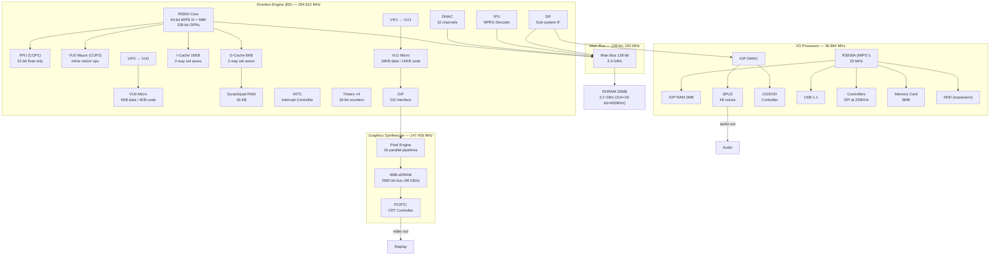
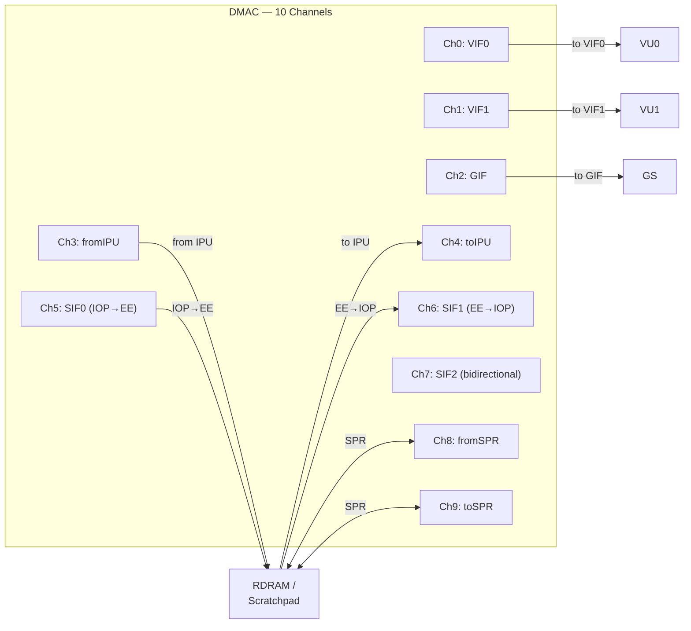
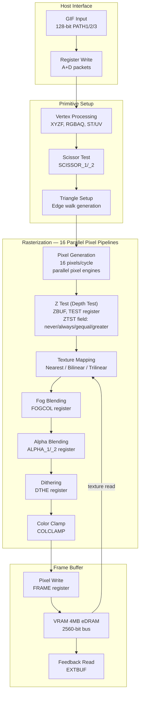
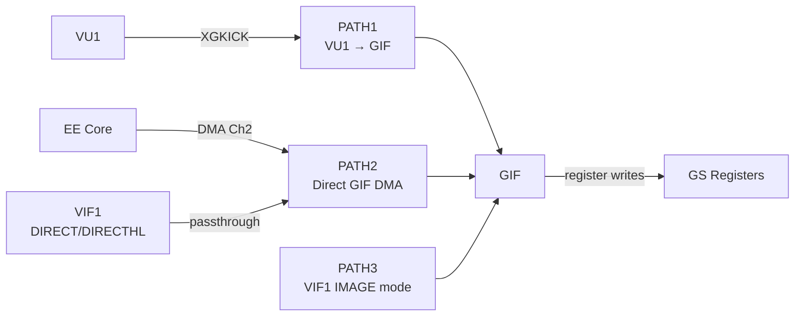
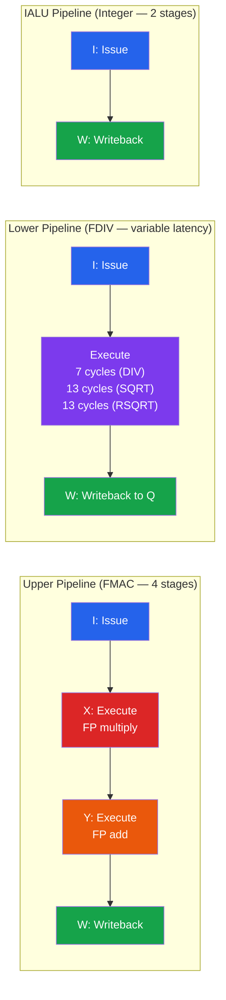
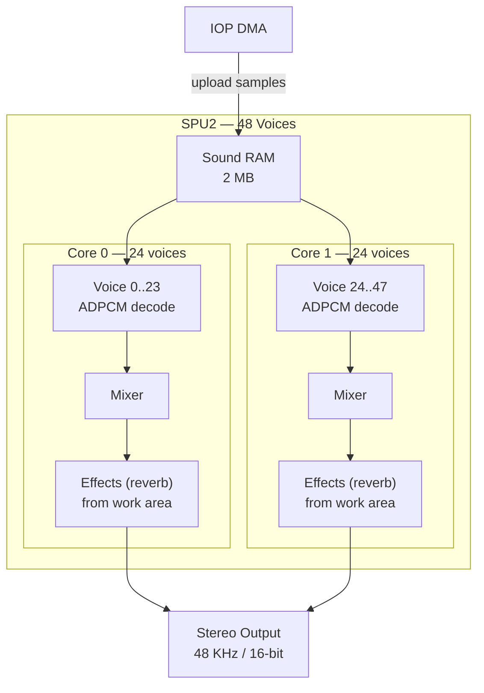
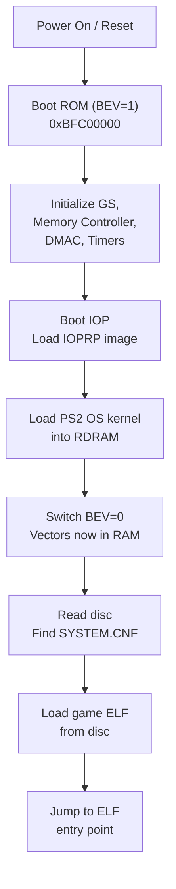
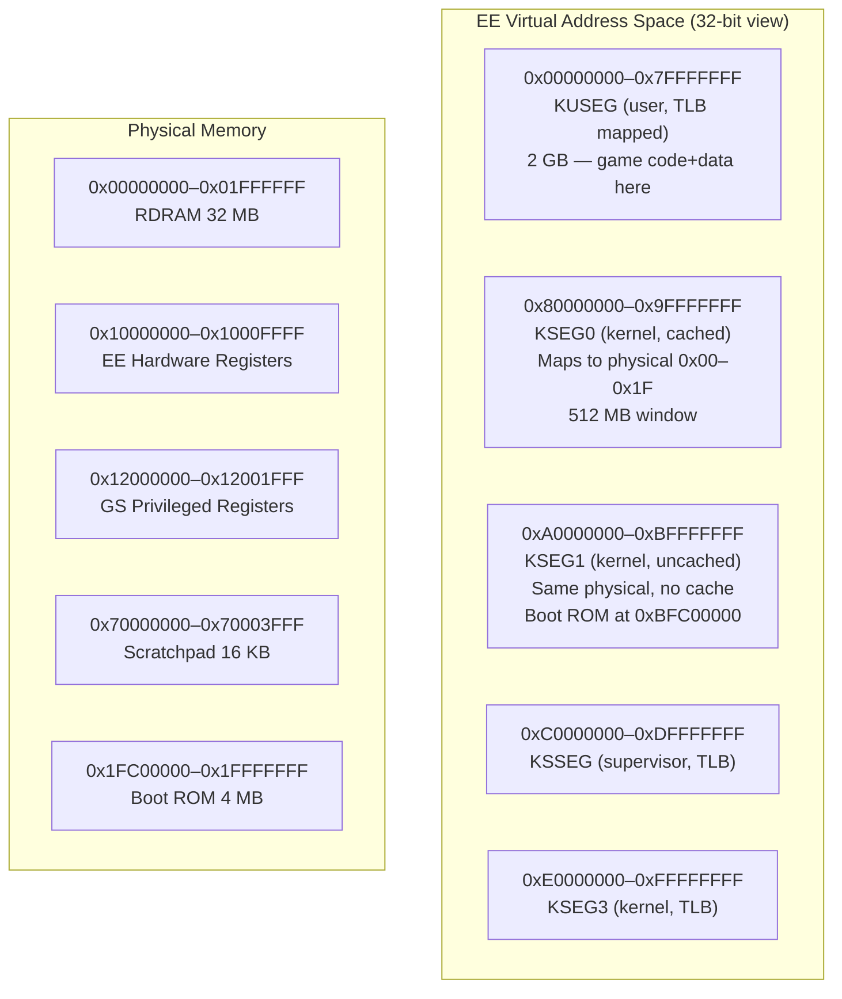
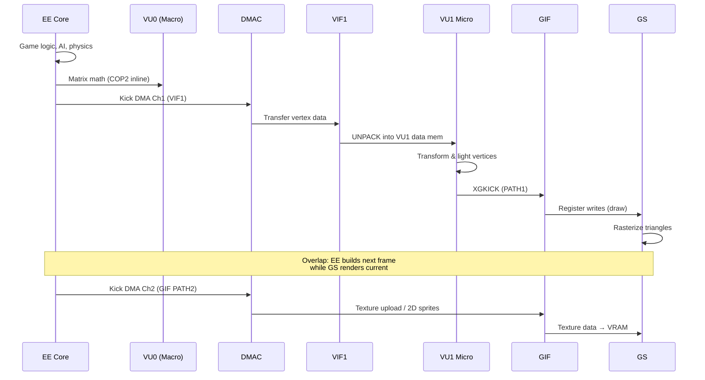

# PS2 Architecture — Complete System Map
> Every subsystem, pipeline, bus, and data path of the PlayStation 2 — described in text and mermaid so an LLM can navigate the entire machine without opening a single PDF.
>
> **Sources**: EE Overview Manual, EE Core Users Manual, EE Users Manual, GS Users Manual + Supplement, VU Users Manual, SPU2 Overview Manual, TX79 Architecture, PS2 Optimisations, eeprogramming, Copetti "PS2 Architecture — A Practical Analysis", ps2_normalmapping, Vector Unit Architecture paper.
>
> **See also**: `db-registers.md` (register addresses + bit-fields), `db-isa.md` (EE Core instruction set), `db-vu-instructions.md` (VU micro instruction set), `db-memory-map.md` (address space layout), `db-syscalls.md` (kernel syscalls), `db-sdk-functions.md` (SDK function stubs).

---

## 1. System-Level Block Diagram



### Key Bandwidths

| Path | Width | Clock | Bandwidth |
|------|-------|-------|-----------|
| Main Bus | 128-bit | 150 MHz | **2.4 GB/s** |
| RDRAM (2 channels) | 2×16-bit | 400 MHz DDR | **3.2 GB/s** |
| GS Local (eDRAM) | 2560-bit | 147 MHz | **48 GB/s** |
| VU0 Data Memory | 128-bit | 294 MHz | **4.7 GB/s** |
| VU1 Data Memory | 128-bit | 294 MHz | **4.7 GB/s** |
| Scratchpad | 128-bit | 294 MHz | **4.7 GB/s** |
| SIF (EE↔IOP) | 32-bit | 37 MHz | **148 MB/s** |
| GIF → GS | 128-bit | 150 MHz | **2.4 GB/s** |
| VIF1 → VU1 | 128-bit | 150 MHz | **2.4 GB/s** |

---

## 2. EE Core (R5900) Pipeline


### Dual-Issue Rules (R5900 Superscalar)

The R5900 can issue **2 instructions per cycle** under these constraints:

| Rule | Pipeline 0 | Pipeline 1 |
|------|-----------|-----------|
| ALU + ALU | ✅ any ALU | ✅ any ALU |
| ALU + Branch | ✅ ALU | ✅ branch |
| ALU + Load/Store | ✅ ALU | ✅ load/store |
| Load + Load | ❌ single issue only | — |
| Branch + Branch | ❌ single issue only | — |
| Multiply + ALU | ✅ mult (pipe 0 only) | ✅ ALU |
| COP1/COP2 + ALU | ✅ COP (pipe 0 only) | ✅ ALU |
| Data hazard | ❌ stalls if pipe 1 reads pipe 0 result in same cycle | — |

### Branch Prediction
- **Static** prediction: backward branches predicted taken, forward not-taken
- **Branch delay slot**: always executed (1 instruction after branch)
- Branch likely instructions: delay slot **nullified** if branch not taken

### Cache Architecture

| Cache | Size | Associativity | Line Size | Fill | Notes |
|-------|------|--------------|-----------|------|-------|
| I-Cache | 16 KB | 2-way set-assoc | 64 bytes | RDRAM refill | |
| D-Cache | 8 KB | 2-way set-assoc | 64 bytes | Write-back | Sub-block ordering + hit-under-miss |
| Scratchpad | 16 KB | Direct-mapped | — | Software managed | Mapped at `0x70000000` |

> **Critical**: Scratchpad is NOT a cache — it's CPU-local SRAM at `0x70000000–0x70003FFF`. DMA can transfer to/from scratchpad as DMA channels 8 (fromSPR) and 9 (toSPR). Games use this heavily as a fast working buffer.

### D-Cache: Sub-Block Ordering & Hit-Under-Miss

- **Sub-block ordering**: When a D-Cache miss occurs, the critical word (the word actually requested by the load) is fetched and delivered to the CPU first, before the rest of the 64-byte cache line fill completes. This reduces effective miss latency.
- **Hit-under-miss**: The D-Cache can service a second load/store that hits the cache while a previous cache miss is still being filled. This partially overlaps miss latency with useful work — similar to a hardware prefetch.

### Memory Access Modes

The EE Core supports three memory access modes (selectable via address segment):

| Mode | Buffer Used | Read Behavior | Write Behavior | When to Use |
|------|------------|---------------|----------------|-------------|
| Cached | D-Cache | Cache line fill on miss | Write-back via WBB | General game logic, repeated data access |
| Uncached | None | Direct RDRAM read | Immediate write-through | Hardware registers, DMA source data |
| Uncached Accelerated | UCAB | Prefetch 8QW into UCAB buffer | Immediate write-through | Display list building, streaming writes |

- **WBB (Write Back Buffer)**: 8-qword FIFO between D-Cache and main bus. Dirty cache lines evicted to the WBB, then drained to RDRAM asynchronously. This decouples cache writebacks from CPU execution.
- **UCAB (Uncached Accelerated Buffer)**: 8-qword dedicated read buffer for uncached-accelerated regions. Provides sequential read speedup without polluting the D-Cache — ideal for streaming through display list data.

### Pipeline Stages Detail

The R5900 has a **6-stage pipeline** (some sources show 5 combined stages):

| Stage | Name | Description |
|-------|------|-------------|
| IF1 | Instruction Fetch 1 | Generate virtual PC, begin I-Cache access |
| IF2 | Instruction Fetch 2 | Complete I-Cache access, select up to 2 instructions for dual-issue |
| ID | Instruction Decode / Issue | Decode opcodes, read register file, check dual-issue compatibility |
| EX | Execute / AGU | ALU result computation, address generation for loads/stores |
| DC | Data Cache Access | D-Cache lookup for loads/stores (sub-block ordering active here) |
| WB | Write Back | Write results to register file |

Branch resolution occurs at EX stage → 1-cycle branch penalty (covered by the delay slot).

---

## 3. DMA Controller (DMAC)

### Channel Map



### DMA Transfer Modes

| Mode | Dn_CHCR.MOD | Description | Use Case |
|------|-------------|-------------|----------|
| Normal | 00 | Single block, Dn_QWC quadwords from Dn_MADR | Simple texture upload |
| Chain | 01 | Linked list of tag+data packets in memory | GIF path 1/2, VIF streams |
| Interleave | 10 | Repeating transfer pattern: transfer `D_SQWC.TQWC` qwords, skip `D_SQWC.SQWC` qwords, repeat | Interlaced image data, interleave transfer for field-based video |

**Interleave transfer** is specifically designed for interlaced video frames — it transfers every Nth row of pixels while skipping the interleaving rows, controlled by `D_SQWC` (DMA Interleave Size register) which specifies both the transfer count and skip count in qwords.

### DMA Tag Format (128 bits)

```
Bits [127:96]  ADDR — next tag address (for chain)  
Bits [95:80]   — reserved  
Bits [79:78]   IRQ+PCE — interrupt request flags
Bits [77:74]   ID — tag type:
                 0=REFE (end, addr from tag)
                 1=CNT  (inline data follows tag)
                 2=NEXT (continue at ADDR)
                 3=REF  (data at ADDR, continue inline)
                 4=REFS (REF + stall control)
                 5=CALL (call ADDR, push return)
                 6=RET  (return to pushed address)
                 7=END  (last transfer)
Bits [63:48]   — reserved
Bits [47:32]   — reserved  
Bits [31:16]   ADDR upper (or reserved)
Bits [15:0]    QWC — quadword count for this tag's data
```

### DMA Priority & Arbitration

Channels share the main bus. Priority order (configurable via `D_PCR`):
1. **Stall control** channels get highest priority when active
2. Default priority: Ch5 (SIF0) > Ch0 > Ch1 > Ch2 > others
3. **Drain channels** (fromIPU, SIF0) must be serviced or they stall the source
4. `D_SQWC` controls interleave slice size to prevent bus starvation

---

## 4. Interrupt Controller (INTC)

```mermaid
graph LR
    subgraph Sources["Interrupt Sources (INTC_STAT bits)"]
        I0["0: GS"]
        I1["1: SBUS (SIF)"]
        I2["2: VB_ON (VBlank start)"]
        I3["3: VB_OFF (VBlank end)"]
        I4["4: VIF0"]
        I5["5: VIF1"]
        I6["6: VU0"]
        I7["7: VU1"]
        I8["8: IPU"]
        I9["9: TIM0"]
        I10["10: TIM1"]
        I11["11: TIM2"]
        I12["12: TIM3"]
        I13["13: SFIFO (SIF FIFO)"]
        I14["14: VU0WD (watchdog)"]
    end

    STAT["INTC_STAT<br/>0x1000F000<br/>(write 1 to clear)"]
    MASK["INTC_MASK<br/>0x1000F010<br/>(write 1 to toggle)"]
    COP0["COP0 Status.IM[2]<br/>(IP2 = INTC line)"]
    
    Sources --> STAT
    STAT -->|"AND"| MASK
    MASK -->|"IP2"| COP0
    COP0 -->|"if IE=1, EXL=0, ERL=0"| EXC["Exception<br/>handler"]
```



### Interrupt Handling Flow

1. Hardware sets bit in `INTC_STAT` (0x1000F000)
2. If corresponding bit in `INTC_MASK` (0x1000F010) is enabled → asserts INT0 to EE
3. EE COP0 sees IP2 pending in Cause register
4. If `Status.IE=1` AND `Status.EXL=0` AND `Status.ERL=0` → exception taken
5. EPC = current PC, ExcCode = 0 (Interrupt), jump to exception vector
6. Handler reads `INTC_STAT` to identify source, clears bit by writing 1 to it

---

## 5. GS Rendering Pipeline



### 16 Parallel Pixel Engines

The GS contains **16 parallel pixel pipelines** (pixel engines / PXEs) that each handle one pixel per cycle. All 16 share the 2560-bit internal eDRAM bus, giving massive fill rate. Each pixel engine independently performs z test, texture lookup, alpha blending, and framebuffer write.

### Z Test (Depth Test)

The `TEST` register's `ZTST` field controls the z test (depth test) function:

| ZTST Value | Function | Description |
|------------|----------|-------------|
| 0 | NEVER | Pixel always fails depth test |
| 1 | ALWAYS | Pixel always passes (no depth testing) |
| 2 | GEQUAL | Pass if pixel Z ≥ framebuffer Z |
| 3 | GREATER | Pass if pixel Z > framebuffer Z |

> The PS2's default depth convention is reversed from typical APIs — closer objects have **larger** Z values. Games using `GEQUAL` are doing a "less-than-or-equal" test in logical space.

### Texture Filtering Modes

| TEX1 Setting | Filter Type | Description |
|--------------|-------------|-------------|
| MMAG/MMIN=0 | Nearest | Point sampling, fastest |
| MMAG/MMIN=1 | Bilinear | 2×2 sample interpolation |
| MMIN=2..5 | Trilinear (Mipmap) | Bilinear + mipmap blending between LOD levels |

**Trilinear filtering** uses `MIPTBP1`/`MIPTBP2` registers to set base pointers for each mipmap level (up to 7 levels). The GS interpolates between two mipmap LODs using bilinear filtering within each level. This requires all mipmap levels pre-uploaded to VRAM with `TEX0.TBP0` pointing to level 0.

### Dual Context Mechanism

The GS maintains **two independent rendering contexts** (Context 1 and Context 2). Each context stores its own set of drawing environment registers (`FRAME`, `ZBUF`, `TEX0`, `ALPHA`, `TEST`, `SCISSOR`, `XYOFFSET`, etc.). The `PRIM` register's `CTXT` bit selects which context applies to the current primitive. This allows two geometry engines (EE+VU0 and VU1) to interleave drawing commands without re-setting all state registers — each geometry path can use its own context.

### GS Pixel Storage Formats

| PSM | Value | BPP | Description | VRAM per 64×32 block |
|-----|-------|-----|-------------|---------------------|
| PSMCT32 | 0x00 | 32 | RGBA 8888 | 8 KB |
| PSMCT24 | 0x01 | 24 | RGB 888 (packed, no alpha) | 6 KB |
| PSMCT16 | 0x02 | 16 | RGBA 5551 | 4 KB |
| PSMCT16S | 0x0A | 16 | RGBA 5551 (swizzled layout) | 4 KB |
| PSMT8 | 0x13 | 8 | 8-bit indexed (CLUT) | 2 KB |
| PSMT4 | 0x14 | 4 | 4-bit indexed (CLUT) | 1 KB |
| PSMT8H | 0x1B | 8 | 8-bit in upper 8 bits of 32-bit | 8 KB (shares with CT32) |
| PSMT4HL | 0x24 | 4 | 4-bit in bits [7:4] of 32-bit | 8 KB (shares) |
| PSMT4HH | 0x2C | 4 | 4-bit in bits [11:8] of 32-bit | 8 KB (shares) |
| PSMZ32 | 0x30 | 32 | 32-bit depth buffer | 8 KB |
| PSMZ24 | 0x31 | 24 | 24-bit depth buffer | 6 KB |
| PSMZ16 | 0x32 | 16 | 16-bit depth buffer | 4 KB |
| PSMZ16S | 0x3A | 16 | 16-bit depth (swizzled) | 4 KB |

### VRAM Block Layout (Column/Page/Block Structure)

VRAM is addressed in **pages** of 2048 pixels:

```
Page = 2048 pixels wide (varies by format)

PSMCT32 page: 64 columns × 32 rows = 2048 pixels = 8192 bytes
  - 1 page = 32 blocks of 8×8 pixels (256 bytes each)
  - Block arrangement within page:
    Block[0]  Block[1]  Block[2]  Block[3]  Block[4]  Block[5]  Block[6]  Block[7]
    Block[8]  Block[9]  Block[10] Block[11] Block[12] Block[13] Block[14] Block[15]
    Block[16] Block[17] Block[18] Block[19] Block[20] Block[21] Block[22] Block[23]
    Block[24] Block[25] Block[26] Block[27] Block[28] Block[29] Block[30] Block[31]

Pixel layout WITHIN a block is NOT linear — it's swizzled for bandwidth.
For PSMCT32, an 8×8 block stores pixels in column-interleaved order.
```

> **Key insight for recompiler**: When games use `sceDmaSync` + GIF PATH2 to upload textures, the VRAM layout matters for correct texture coordinates. Most games use `TEX0.TBW` (buffer width) aligned to page boundaries.

### GS Drawing Primitives

| PRIM | Value | Description | Vertices |
|------|-------|-------------|----------|
| POINT | 0 | Single pixel | 1 |
| LINE | 1 | Line segment | 2 |
| LINESTRIP | 2 | Connected lines | 2+ |
| TRIANGLE | 3 | Filled triangle | 3 |
| TRISTRIP | 4 | Triangle strip | 3+ |
| TRIFAN | 5 | Triangle fan | 3+ |
| SPRITE | 6 | Axis-aligned rectangle | 2 (corners) |

### GIF Data Paths



- **PATH1**: VU1 issues `XGKICK` — sends GIF packet from VU1 data memory directly to GS. Used for transformed geometry.
- **PATH2**: DMA channel 2 sends data from RDRAM through GIF. Used for texture uploads, direct drawing.
- **PATH3**: VIF1 `DIRECT`/`DIRECTHL` command passes data through to GIF. Used for streaming vertex data.

---

## 6. VU (Vector Unit) Architecture

### VU0 vs VU1 Comparison

| Feature | VU0 | VU1 |
|---------|-----|-----|
| Code Memory | 4 KB (256 instructions) | 16 KB (1024 instructions) |
| Data Memory | 4 KB (256 QW) | 16 KB (1024 QW) |
| Macro Mode (COP2) | ✅ Yes | ❌ No |
| Micro Mode | ✅ Yes | ✅ Yes |
| GIF Path | ❌ (via EE registers) | ✅ PATH1 (XGKICK) |
| Feed Source | VIF0 | VIF1 |
| Typical Use | Clipping, lighting helpers | Transform + lighting main |

### VU Micro Pipeline (FMAC + FDIV + IALU)



**Every cycle, the VU executes TWO instructions simultaneously**:
- **Upper instruction**: FMAC operation (add, multiply, max, min, etc.)
- **Lower instruction**: IALU (integer ALU), load/store, branch, FDIV/SQRT, or special

### IALU Pipeline

The **IALU pipeline** handles all lower-instruction integer operations (`IADDIU`, `ISUB`, `IAND`, `IOR`, integer loads/stores `ILW`/`ISW`, branches). It has **2 stages** (Issue → Writeback), so integer results are available the next cycle with no stall. The IALU operates on the 16-bit `vi` registers (VI[0]–VI[15]).

### FMAC Pipeline Hazards

| Hazard Type | Stall Cycles | Condition |
|-------------|-------------|-----------|
| RAW (Read After Write) | 0–3 | Reading reg written N cycles ago |
| FMAC → FMAC (immediate use) | **3 cycles** | `VADD vf1 ...` then `VMUL ... vf1` next cycle |
| FMAC → FMAC (+1 cycle gap) | **2 cycles** | 1 unrelated instruction between |
| FMAC → FMAC (+2 cycle gap) | **1 cycle** | 2 unrelated instructions between |
| FMAC → FMAC (+3 cycle gap) | **0 cycles** | No stall — result available |
| FDIV → use Q | depends | Must wait for FDIV pipeline to finish |
| IALU → use vi result | **0 cycles** | Integer result available next cycle |

> **Optimization**: Games interleave independent operations to hide FMAC latency. A common pattern is processing 3–4 vertices simultaneously in the VU program.

### VIF (VU Interface) Unpack Formats

VIF's `UNPACK` command decompresses data into VU data memory:

| VN | VL | Format | Components × Bits | Expansion |
|----|-----|--------|-------------------|-----------|
| 00 | 00 | S-32 | 1 × 32-bit float | x → {x,x,x,x} |
| 00 | 01 | S-16 | 1 × 16-bit int | x → {x,x,x,x} (sign-extend) |
| 00 | 10 | S-8 | 1 × 8-bit int | x → {x,x,x,x} (sign-extend) |
| 01 | 00 | V2-32 | 2 × 32-bit float | {x,y} → {x,y,0,0} |
| 01 | 01 | V2-16 | 2 × 16-bit int | {x,y} → {x,y,0,0} |
| 01 | 10 | V2-8 | 2 × 8-bit int | {x,y} → {x,y,0,0} |
| 10 | 00 | V3-32 | 3 × 32-bit float | {x,y,z} → {x,y,z,0} |
| 10 | 01 | V3-16 | 3 × 16-bit int | {x,y,z} → {x,y,z,0} |
| 10 | 10 | V3-8 | 3 × 8-bit int | {x,y,z} → {x,y,z,0} |
| 11 | 00 | V4-32 | 4 × 32-bit float | {x,y,z,w} |
| 11 | 01 | V4-16 | 4 × 16-bit int | {x,y,z,w} |
| 11 | 10 | V4-8 | 4 × 8-bit int | {x,y,z,w} |
| 11 | 11 | V4-5 | 4 × 5-bit (packed 16-bit) | 1:5:5:5 → {r,g,b,a} |

VIF flags: `USN` = unsigned (zero-extend instead of sign-extend), `FLG` = use write mask, `M` = use fill mode.

---

## 7. SPU2 (Sound Processing Unit 2)



### Voice Parameters

Each of the 48 voices has:
- **Pitch**: 16-bit (4.12 fixed point, 1.0 = 44.1 KHz sample rate)
- **Volume**: 16-bit per L/R channel, with sweep modes (linear/exponential/pseudo-exponential)
- **ADSR Envelope**: Attack, Decay, Sustain level, Sustain rate, Release — all configurable
- **ADPCM source**: Start address in Sound RAM (28 samples per 16-byte block, 4-bit encoded)
- **Loop**: ADPCM blocks have loop flags (start/repeat/end)
- **Noise generator**: Each voice can be switched to output pseudo-random noise instead of ADPCM waveform data (controlled by the PMON/NON register bits). The noise generator uses a shift register to produce white noise at the voice's pitch rate.
- **FM modulation**: Voice N can frequency-modulate voice N+1

### ADSR Envelope (Attack, Decay, Sustain, Release)

Each voice has a 4-phase amplitude envelope generator that shapes the volume over time:

| Phase | Rate Register | Mode | Description |
|-------|--------------|------|-------------|
| **Attack** | Attack Rate (Ar) | Linear or Exponential | Volume ramps from 0 to max. Attack rate sets the slope speed. |
| **Decay** | Decay Rate (Dr) | Exponential only | Volume decays from max to the Sustain Level (Sl). Decay rate is always exponential. |
| **Sustain** | Sustain Rate (Sr) | Linear or Exponential, Inc/Dec | Volume adjusts toward sustain target. Can increase or decrease. Rate and direction configurable. |
| **Release** | Release Rate (Rr) | Linear or Exponential | After key-off, volume decays to 0. Release rate sets decay speed. |

The Sustain Level (Sl) sets the target amplitude for the decay phase (16 levels, 0–15). All rates are encoded as a step value + shift — the actual time depends on the sample rate and divisor.

### SPU2 ADPCM Format

```
16 bytes per block = 28 samples:
  Byte 0:    shift[3:0] | filter[6:4] | reserved[7]
  Byte 1:    flags: [0]=loop end, [1]=loop repeat, [2]=loop start
  Bytes 2-15: 28 × 4-bit samples (14 bytes, 2 samples per byte)

Decode: sample = clamp(data << shift + filter[0] * prev1 + filter[1] * prev2)
```

### SPU2 Voice Control & DMA

| Register / Concept | Description |
|---------------------|-------------|
| **KEY ON** (KON) | Writing a bit mask to KON starts the ADSR attack phase for selected voices. One bit per voice per core. |
| **KEY OFF** (KOFF) | Writing a bit mask to KOFF triggers the release phase for selected voices. One bit per voice per core. |
| **ENDX** | Read-only status register — one bit per voice. Set when a voice reaches an ADPCM block with the "loop end" flag. Cleared on KEY ON. Used by software to detect sample playback completion. |
| **AutoDMA** | A streaming mode where the IOP DMA feeds audio data directly into Core 0 / Core 1 mixing buffers, bypassing the voice system. Used for CD streaming, movie audio, and PCM playback. AutoDMA channel 0 feeds Core 0's input buffer; channel 1 feeds Core 1's. |
| **Effect area** | A region of Sound RAM dedicated to reverb processing for each core. The effect area stores delay lines and feedback buffers used by the reverb algorithm. Its size and base address are configured per core. Effects include room/hall/studio reverb, delay, echo, and pipe simulations. |

---

## 8. IOP Subsystem

The IOP runs a **MIPS I (R3000A)** at 36.864 MHz with 2 MB RAM. It handles:

| Subsystem | Connection | Purpose |
|-----------|-----------|---------|
| Controllers | SPI (250 KHz) | DualShock2 gamepad, multitap |
| Memory Cards | SPI (250 KHz) | 8 MB save storage |
| CD/DVD | ATAPI-like | Game data, streaming FMV |
| USB 1.1 | Host controller | Peripherals |
| IEEE 1394 | i.LINK | Network adapter (early model) |
| Ethernet | SMAP (PCMCIA) | Network play (expansion) |
| HDD | ATAPI | PS2 HDD (expansion bay) |
| SPU2 | DMA | Sound RAM access |

### SIF (Sub-system Interface)

EE ↔ IOP communication via shared registers:
- **SIF0**: IOP → EE DMA (channel 5) — IOP sends data to EE
- **SIF1**: EE → IOP DMA (channel 6) — EE sends commands to IOP
- **SIF2**: Bidirectional (channel 7) — rarely used  
- **SMFLG**: Shared mailbox flags (0x1000F230) — used for synchronization
- **SIF RPC**: High-level RPC mechanism built on SIF DMA — games call IOP modules this way

---

## 9. Exception Vectors, COP0, & Boot Flow

### Exception Vector Addresses

| Vector | BEV=0 (Normal) | BEV=1 (Bootstrap) | Trigger |
|--------|----------------|-------------------|---------|
| Reset | — | `0xBFC00000` | Hardware reset |
| TLB Refill | `0x80000000` | `0xBFC00200` | Translation Lookaside Buffer miss |
| Counter | `0x80000080` | `0xBFC00280` | Performance counter overflow |
| Debug | `0x80000100` | `0xBFC00300` | Hardware breakpoint / debug exception |
| Common | `0x80000180` | `0xBFC00380` | All other exceptions (general exception handler) |
| Interrupt | `0x80000200` | `0xBFC00400` | Hardware interrupt exception |

### Exception Processing Flow

When an exception occurs, the hardware performs these steps atomically:
1. `EPC` ← current PC (or faulting PC for address errors)
2. `Cause.ExcCode` ← exception type code
3. `Status.EXL` ← 1 (enters exception level, disabling further interrupts)
4. PC ← appropriate exception vector address (based on `Status.BEV` and exception type)
5. The general exception handler reads `Cause.ExcCode` to dispatch to the correct handler.

For **interrupt exceptions** specifically, the handler reads `INTC_STAT` and/or `DMAC D_STAT` to identify the specific interrupt source.

### COP0 System Control Registers (Key Registers)

| Register | Number | Description |
|----------|--------|-------------|
| Index | 0 | TLB entry index for probe/read/write |
| Random | 1 | Pseudo-random TLB entry index for `TLBWR` |
| EntryLo0/1 | 2, 3 | TLB entry low bits (PFN, cache attributes) |
| Context | 4 | Context register — stores BadVPN2 for fast TLB refill handler |
| PageMask | 5 | TLB page size mask |
| Wired | 6 | Number of wired (non-replaceable) TLB entries |
| BadVAddr | 8 | Faulting virtual address |
| Count | 9 | Count register — free-running timer, increments every cycle |
| EntryHi | 10 | TLB entry high bits (VPN2, ASID) |
| Compare | 11 | Timer compare — interrupt when Count = Compare |
| Status | 12 | Status register (IE, EXL, ERL, KSU, IM, BEV, etc.) |
| Cause | 13 | Exception cause code and pending interrupt bits |
| EPC | 14 | Exception Program Counter — return address after exception |
| PRId | 15 | Processor Revision ID (R5900 = 0x2E20) |
| Config | 16 | Cache and bus configuration |
| BadPAddr | 23 | Bad physical address (bus errors) |
| BPC | 24 | Hardware breakpoint control |
| IAB/IABM | 32,33 | Instruction Address Breakpoint + mask |
| DAB/DABM | 34,35 | Data Address Breakpoint + mask |
| DVB/DVBM | 36,37 | Data Value Breakpoint + mask |
| PerfCnt | 25 | Performance counter control and value |
| TagLo/TagHi | 28, 29 | Cache tag registers for CACHE instruction |
| ErrorEPC | 30 | Error exception program counter |

### Translation Lookaside Buffer (TLB)

The R5900 has a **48-entry fully-associative TLB** that maps virtual pages to physical frames. Most PS2 games run in KSEG0/KSEG1 (direct-mapped segments that bypass the TLB), but the kernel and some games use TLB-mapped KUSEG space.

- **TLB Refill exception**: Triggered when no TLB entry matches the virtual address being accessed. The PS2 OS refill handler reads the `Context register` to quickly locate the page table entry.
- Page sizes: 4KB, 16KB, 64KB, 256KB, 1MB, 4MB, 16MB (set via `PageMask`)

### Hardware Breakpoints

The R5900 supports **hardware breakpoints** via COP0 registers BPC, IAB, DAB, DVB:
- **Instruction breakpoint (IAB/IABM)**: Break on instruction fetch at address (with mask)
- **Data breakpoint (DAB/DABM)**: Break on data load/store at address
- **Data value breakpoint (DVB/DVBM)**: Break when data matching a value is read/written
- Triggers a **Debug exception** (vector at `0x80000100` / `0xBFC00300`)

### Boot Sequence



---

## 10. R5900 Floating Point Quirks

The R5900 FPU (COP1) is **NOT IEEE 754 compliant**:

| Behavior | IEEE 754 | R5900 |
|----------|----------|-------|
| Denormals | Supported | **Flushed to zero** |
| NaN | Quiet/Signaling | Always returns `0x7FBFFFFF` |
| ±Infinity | Standard | `±MAX_FLOAT` (0x7F7FFFFF / 0xFF7FFFFF) |
| Rounding | 4 modes | **Round-to-zero only** (truncation) |
| Exceptions | Full set | **None** — no FP exceptions |
| Precision | Full 23-bit mantissa | Some ops have **reduced precision** |

> **Recompiler impact**: x86/x64 FPU uses IEEE 754 by default. The recompiler must clamp denormals to zero and handle NaN/Inf differently. Some games depend on the R5900's non-standard behavior.

---

## 11. Normal Mapping on PS2

> Source: ps2_normalmapping.pdf

PS2 lacks hardware normal mapping. The technique uses VU1 to:

1. **Encode normals** into a cube map stored in GS VRAM
2. **Per-vertex in VU1**: Transform light vector to tangent space
3. **Use light vector as texture coords** to index into the cube map
4. **Cube map lookup** returns the dot product (N·L) as intensity
5. **Second pass**: Apply intensity to diffuse texture via alpha blending

Key constraints:
- Requires **2 rendering passes** minimum (dot product lookup + diffuse apply)
- Cube map resolution trades quality for VRAM space
- VU1 program must compute tangent-space light vector per vertex
- Uses `TEX0.TCC=1` (texture with CLUT) for efficient storage

---

## 12. PS2 Optimization Patterns

> Source: PS2Optimisations.pdf, eeprogramming.pdf

### DMA Double-Buffering

```
Frame N:
  CPU builds display list → Buffer A
  DMA sends Buffer B → GIF/VIF
  
Frame N+1:
  CPU builds display list → Buffer B  
  DMA sends Buffer A → GIF/VIF
```

### DMA Triple Buffering

Triple buffering extends double-buffering with a **third buffer** to decouple CPU, DMA, and VU processing stages:

```
Buffer A: CPU building display list (writing)
Buffer B: DMA transferring to VIF/GIF (reading)
Buffer C: VU1 processing previous data (executing)

Rotate: A→B→C→A each frame/batch
```

Triple buffering prevents all stalls when the three stages have variable latency — e.g. if VU1 transformation takes longer than CPU list building, the DMA stage absorbs the difference.

### Scratchpad Usage Pattern

```
1. DMA toSPR: Transfer working data from RDRAM → Scratchpad
2. CPU processes data in Scratchpad (4.7 GB/s access)
3. DMA fromSPR: Transfer results Scratchpad → RDRAM
4. Repeat with next data chunk
```

### VU1 Double Buffer Pattern

```
VU1 Data Memory layout:
  0x000–0x1FF: Buffer A (vertex data being transformed)
  0x200–0x3FF: Buffer B (vertex data being uploaded via VIF1)

While VU1 processes Buffer A:
  VIF1 UNPACK writes next vertices into Buffer B
When VU1 finishes Buffer A:
  Swap pointers, process Buffer B, VIF1 fills Buffer A
```

### GS FIFO / DMA.STR Considerations

The GIF has a **GS FIFO** (internal GIF-to-GS pipeline buffer). When the GS is busy rasterizing and cannot accept new data, the GS FIFO fills up, which back-pressures the GIF→DMA chain. Monitoring `GIF_STAT` and avoiding GS FIFO overflow is important for maintaining throughput.

The `DMA.STR` (Start) bit in `Dn_CHCR` initiates a DMA transfer. Setting `STR=1` while the channel is already active is undefined. Always check `Dn_CHCR.STR==0` or use the DMAC interrupt before re-arming a channel.

### Geometry Pipeline & Transformation

The EE implements a multi-stage **geometry pipeline** using the VU units:

1. **Model space**: Vertices in local coordinates
2. **World transformation**: Model → World matrix multiply (typically in VU0 macro or VU1)
3. **View transformation**: World → Camera matrix multiply
4. **Projection transformation**: Camera → Clip space (perspective divide)
5. **Viewport transformation**: Clip → Screen coordinates (GS expects 12.4 fixed-point XY + 24-bit Z)
6. **XGKICK**: Transformed primitives sent directly to GS via PATH1

Games typically combine World+View+Projection into a single 4×4 matrix for efficiency, performing one matrix-vector multiply per vertex.

### Key Performance Rules

1. **Never let the main bus idle**: Overlap DMA with CPU/VU computation
2. **Use scratchpad** for all temporary matrices, vertex buffers, working data
3. **Pack vertex data** using VIF UNPACK — 8-bit or 16-bit vertex components save bus bandwidth
4. **Batch GS draws**: Minimize register state changes between primitives
5. **MFIFO (Memory FIFO)**: Use circular DMA buffer in RDRAM for GIF path — builds display lists while DMA consumes them
6. **EE + VU0 parallel**: EE drives game logic while VU0 (macro mode) does matrix math inline
7. **Align to cache lines**: 64-byte alignment for DMA source/destination prevents partial line fills

---

## 13. IPU — Image Data Processor

The **IPU (Image Data Processor)** is a dedicated MPEG-2 / JPEG decoding engine on the EE. It decompresses image data in hardware, offloading video decode from the CPU.

### IPU Features
- **MPEG-2 macroblock decoding**: Intra (I) and predictive (P) macroblocks via IDEC/BDEC commands
- **JPEG-like decode**: DCT + quantization + color space conversion (CSC) from YCbCr to RGB
- **Variable-length decoding (VDEC/FDEC)**: Huffman table decode for MPEG-2 bitstreams
- **Quantization table setup**: `SETIQ` command loads inverse quantization matrices
- **Threshold filter**: `SETTH` command sets transparency thresholds for decoded pixels

### IPU DMA Channels
- **Channel 3 (fromIPU)**: Decoded output data flows from IPU → main memory
- **Channel 4 (toIPU)**: Compressed bitstream data flows from memory → IPU

IPU processing is asynchronous — the CPU issues a decode command, and the IPU processes the compressed stream via DMA while the CPU continues other work.

---

## 14. Memory Map Summary Diagram



> For the complete register-level memory map, see `db-memory-map.md`.
> For register bit-fields, see `db-registers.md`.

---

## 15. PS2 Game Data Flow (Typical Frame)



---

## Cross-Reference to Other Knowledge Base Files

| Topic | File | Key Sections |
|-------|------|-------------|
| Hardware register addresses | `db-registers.md` | Timer, DMA, INTC, GIF, VIF, GS, IPU |
| Hardware register bit-fields | `db-registers.md` | COP0, GS TEX0/FRAME/ZBUF, DMA channels |
| R5900 instruction set | `db-isa.md` | Integer, Branch, Load/Store, MMI, COP0/1/2 |
| VU micro instructions | `db-vu-instructions.md` | Upper (FMAC), Lower (FDIV/Integer/Branch) |
| EE memory map + ELF layout | `db-memory-map.md` | Address ranges, segment mapping, kernel areas |
| PS2 SDK functions | `db-sdk-functions.md` | sceDma*, sceGs*, scePad*, sceVif*, file I/O |
| Syscalls + stubs | `db-syscalls.md` | Syscall table, IOP RPC, stub linking |
| PS2Recomp pipeline | `ps2recomp-pipeline.md` | TOML config, build process, override system |
| Ghidra + GhydraMCP | `ghidra-ghydramcp-guide.md` | Analysis workflow, MCP tools |
| Game porting playbook | `game-porting-playbook.md` | Step-by-step porting methodology |
| Common code patterns | `ps2-code-patterns.md` | Pattern recognition in decompiled code |
| PS2 hardware deep reference | `ps2tek.md` | Comprehensive register/format reference |
